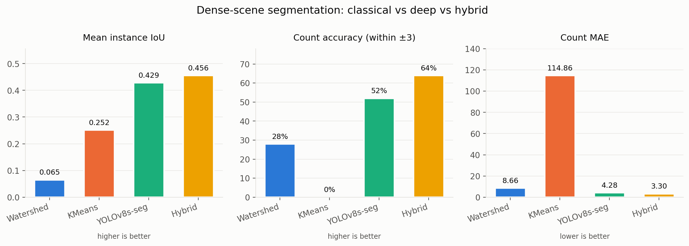
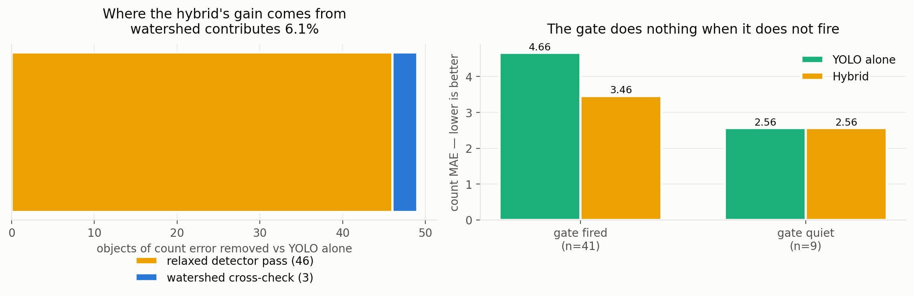

# High-Density Object Segmentation

**Counting and segmenting objects in crowded scenes — where classical computer vision breaks down, by how much, and whether a hybrid beats either approach alone.**

Pranay Sarkar · Newton School of Technology

<!-- DEMO -->

---

## The question

A photograph with three objects in it is a solved problem. A photograph with thirty
overlapping objects — a market stall, a parked street, a crowd — is not, and the
methods that work on the first often fail in ways that are specific and
predictable on the second.

This project measures that failure on **COCO val2017 images containing 5–50
non-crowd objects**, then asks whether a detector and a classical method can be
combined to beat either one alone.

Three methods and one combination are compared:

| | |
|---|---|
| **Watershed** | Marker-based classical segmentation. Otsu threshold → morphological opening → distance transform → watershed. |
| **KMeans** | Colour clustering followed by per-cluster connected components. |
| **YOLOv8s-seg** | Fine-tuned on the dense subset for 10 epochs. |
| **Hybrid** | Detects crowding with a Canny edge-density test, *then* relaxes the detector and cross-checks the count against watershed. See the ablation below for which of those two mechanisms actually does the work. |

---

## Results

<!-- RESULTS:BEGIN -- generated by scripts/update_readme.py, do not edit -->

| Method | Type | Mean IoU | Count acc. (±3) | MAE | Median latency |
|---|---|---|---|---|---|
| Watershed | Classical | 0.065 | 28% | 8.66 | 13 ms <sub>(IQR 11–17)</sub> |
| KMeans (k=5) | Classical | 0.252 | 0% | 114.86 | 88 ms <sub>(IQR 70–110)</sub> |
| YOLOv8s-seg (fine-tuned) | Deep learning | 0.429 | 52% | 4.28 | 26 ms <sub>(IQR 24–30)</sub> |
| Hybrid (density-aware) | Hybrid | **0.456** | **64%** | **3.30** | 62 ms <sub>(IQR 54–71)</sub> |

<sub>All four methods scored in a **single run** on the same 50 held-out test images, with the same metric definitions, on the same device — `cuda`, seed `1337`, 2026-09-22. Instance IoU is class-agnostic under greedy one-to-one matching; unmatched ground-truth objects score 0 and are included in the mean. Latency is a median with an interquartile range, not a mean over a cold start. torch 2.11.0+cu128, ultralytics 8.4.38, weights `yolov8s-seg-dense.pt`.</sub>

<sub>The hybrid's density gate fired on **41 of 50** test images; the watershed cross-check then altered the count on **4** of them.</sub>

<!-- RESULTS:END -->



Every number above is generated into this README from
`results/metrics/unified_results.json` by `scripts/update_readme.py`. Typing one
by hand is how the previous version of this project went wrong.

**Read the KMeans row carefully — it is the most instructive one here.** KMeans
scores a respectable 0.252 IoU while getting the object count right on *zero* of
the 50 images. It emits **127.5 masks per image against 12.6 real objects**: spray
ten times as many regions as there are objects and greedy matching will find
overlaps by chance. A single IoU figure cannot distinguish that from segmenting
well, which is exactly why every method here is reported on counting metrics
alongside IoU rather than on overlap alone.

---

## Why the classical methods fail, specifically

Both baselines fail for structural reasons, not for want of tuning — which is
the interesting part, because it means no amount of parameter search rescues them.

**Watershed under-counts.** Otsu thresholding assumes a bimodal intensity
histogram: foreground separable from background by brightness alone. A natural
photograph of a crowded street has no such split. The distance transform then
merges touching objects into a single basin, so the method fails hardest exactly
where this project cares most.

**KMeans over-counts, badly.** Colour clustering carries no object prior at all.
A striped shirt fragments across several clusters and each fragment is counted as
its own instance, while a plain wall shatters into dozens of regions on lighting
gradients alone.

---

## The hybrid, and what it actually improves

```
image
  │
  ├─ YOLOv8s-seg @ conf 0.25, NMS IoU 0.45 ──────────────┐
  │                                                       │
  └─ Canny edge density ─── > 0.08  OR  count ≥ 10 ?      │
                                │                         │
                       ┌────────┴────────┐                │
                      no                yes               │
                       │                 │                │
                       │     relaxed pass @ conf 0.15,    │
                       │     NMS IoU 0.35 — recovers      │
                       │     instances a crowd suppresses │
                       │                 │                │
                       │     watershed cross-check:       │
                       │     regions > 1.2 × detections?  │
                       │     → count = 0.8·YOLO + 0.2·WS  │
                       │                 │                │
                       └────────┬────────┘                │
                                ▼                         ▼
                          final count              instance masks
```

The gate uses **Canny edge density rather than the detector's own count**, and
that ordering is the point: if the detector has already missed the crowd, its
count cannot be the signal that tells you a crowd is there. Canny costs well
under a millisecond, so the test is close to free.

**What the hybrid improves is counting, not mask quality.** Its masks come from a
YOLO pass, so its IoU tracks YOLO's closely. When the watershed cross-check
fires, the method raises its *count estimate* without being able to say where the
extra objects are — so `count` and the number of masks drawn can differ, and both
are reported rather than one implying a localisation that was never produced.

---

## Ablation: which half of the hybrid does the work?

The hybrid has two mechanisms — a density gate that triggers a relaxed second
detector pass, and a watershed cross-check that can raise the final count.
Reporting only the combined result would let a reader assume both matter.

They do not. `src/ablation.py` decomposes the gain:

| Mechanism | Images it fired on | Count error removed |
|---|---|---|
| Relaxed detector pass | 41 / 50 | **46 objects** |
| Watershed cross-check | 4 / 50 | **3 objects** |



So the watershed component — the part that makes this nominally a "deep +
classical hybrid" — contributes **6%** of the improvement. The method is more
honestly described as **density-aware two-pass detection with a marginal
classical correction**, and that is how it is described here.

The gate itself behaves correctly. On the 9 images where it did not fire, the
hybrid's MAE is **2.56 — identical to YOLO's 2.56**. It costs nothing when it is
not needed, which is the property a gate has to have before its cost on the
other 41 images is worth paying.

What this ablation does *not* establish: with 50 test images and 4 blend events,
the watershed cross-check is not shown to be useless, only unmeasurable at this
sample size. It happened to improve 3 of those 4 images and leave the fourth
unchanged. A larger test split is the obvious next step.

---

## Reproducing the results

Python 3.9+, ~2 GB of disk for COCO val2017.

```bash
python3 -m venv --system-site-packages .venv
.venv/bin/pip install -r requirements.txt

# COCO val2017 (images + instance annotations)
mkdir -p data && cd data
curl -LO http://images.cocodataset.org/zips/val2017.zip
curl -LO http://images.cocodataset.org/annotations/annotations_trainval2017.zip
unzip -q annotations_trainval2017.zip -d annotations
mkdir -p images && unzip -q val2017.zip -d images && cd ..

PYTHONPATH=src .venv/bin/python src/prepare_yolo_data.py   # seeded dense subset
PYTHONPATH=src .venv/bin/python src/train.py               # fine-tune
PYTHONPATH=src .venv/bin/python src/evaluate.py            # ALL methods, one run
PYTHONPATH=src .venv/bin/python src/figures.py             # figures from that run
PYTHONPATH=src .venv/bin/python src/ablation.py            # decompose the hybrid
.venv/bin/python scripts/update_readme.py                  # table from that run
```

The fine-tuned checkpoint is committed at `weights/yolov8s-seg-dense.pt`, so
`evaluate.py` runs without retraining.

Every random draw is seeded from `src/config.py` (`SEED = 1337`): the dense
subset, the train/val/test split, KMeans initialisation and the training run.

---

## What changed in v2, and why

The first version of this project published numbers it could not support. They
are listed here rather than quietly corrected, because how a result was wrong is
usually more informative than the result.

| Problem | What was wrong | Fix |
|---|---|---|
| **Two experiments, one table** | Mean IoU came from Phase 2 (50 images, 10 epochs, CPU); count accuracy and MAE came from Phase 3 (100 images, 4 epochs, T4 GPU). They were printed as a single row. Recomputing Phase 2 from its own raw records gives 58.0% accuracy and MAE 3.70 — not the 64% / 3.16 that was published beside its IoU. | `src/evaluate.py`: one harness, one test set, one device, one run. |
| **IoU for methods that produced no masks** | `watershed_segmentation()` and `kmeans_color_segmentation()` returned an integer. The "Mean IoU ~0.05 / ~0.01" published for them could not have come from this code. | Both now return instance masks, scored by the same function as YOLO. |
| **A fabricated table row** | `ablation_table.csv` listed KMeans as `0.05 / 24.0 / 8.0` — an exact copy of the Watershed row — while `baseline_results.json` recorded KMeans at 0.0% accuracy and MAE 115.51. | Tables are generated from the results file; the CSV is an output, not an input. |
| **Unverifiable latency** | The README claimed ~18 ms. Raw records showed a median of 96 ms and a 12.7-second cold start; the ablation CSV said 1650.9 ms — a mean dragged by that one outlier. | Warm-up before timing; median and IQR reported, never a mean. |
| **Non-random sampling** | The subset was `dense_ids[:500]` — the 500 lowest COCO image IDs. | Seeded uniform sample from the full pool of 2,463 dense images. |
| **Nothing was reproducible** | `.gitignore` contained a blanket `*.pt`, so the trained weights could never be committed — and they were lost. Both model notebooks were committed with their cells unexecuted; the Phase-3 notebook had zero outputs. | Weights committed; notebooks generated from `src/` and executed in CI-able form. |
| **Numbers that were not numbers** | The table published `~0.05`, `~0.01`, `0.523+`. | Generated to fixed precision from the data. |

---

## Repository layout

```
src/
  config.py              single source of truth — seed, paths, every threshold
  metrics.py             one IoU definition, one counting definition
  baseline.py            watershed & kmeans — both return instance masks
  hybrid.py              density gate, relaxed pass, watershed cross-check
  prepare_yolo_data.py   COCO → YOLO seg format, seeded sampling and split
  train.py               fine-tuning entry point
  evaluate.py            THE evaluation harness — all methods, one run
  ablation.py            decomposes the hybrid's gain between its two mechanisms
  figures.py             every figure, regenerated from the results file
scripts/
  build_notebooks.py     notebooks are generated artefacts, not hand-edited
  update_readme.py       results table generated into the README (--check for CI)
notebooks/
  01_eda.ipynb                  dataset density and split provenance
  02_methods_and_results.ipynb  all four methods on one image, then the numbers
results/
  metrics/unified_results.json  the single source of every published number
  metrics/ablation.json         the hybrid decomposition
  figures/                      the only copy of the figures
weights/
  yolov8s-seg-dense.pt          the fine-tuned checkpoint
report/
  main.tex                      LaTeX report
space/
  app.py                        Gradio demo
```

---

## Limitations

- **Test split is 50 images.** Small enough that differences of a few percentage
  points between the top two methods are not separable from noise. Treat the
  classical-versus-deep gap as the finding; treat the hybrid-versus-YOLO gap as
  a direction, not a proven margin.
- **Fine-tuned on COCO, evaluated on COCO.** The base checkpoint was pretrained
  on COCO, so this measures adaptation to the dense subset, not generalisation to
  a new domain.
- **Class-agnostic scoring.** Necessary to put pixel-clustering baselines on the
  same scale as a detector, but it means a correct mask with the wrong label
  scores as a hit.
- **Single-polygon conversion.** COCO instances annotated as multiple disjoint
  polygons keep only their largest part, a constraint of the YOLO segmentation
  label format.
- **Latency is measured on Apple Silicon MPS**, not a server GPU, and the
  classical baselines are single-threaded CPU. Compare the methods to each other,
  not to published GPU timings.

---

## Citation

```bibtex
@misc{sarkar2026hdos,
  author = {Pranay Sarkar},
  title  = {High-Density Object Segmentation: Classical, Deep Learning, and Hybrid Approaches},
  year   = {2026},
  url    = {https://github.com/Zakuroooo/high-density-object-segmentation}
}
```
